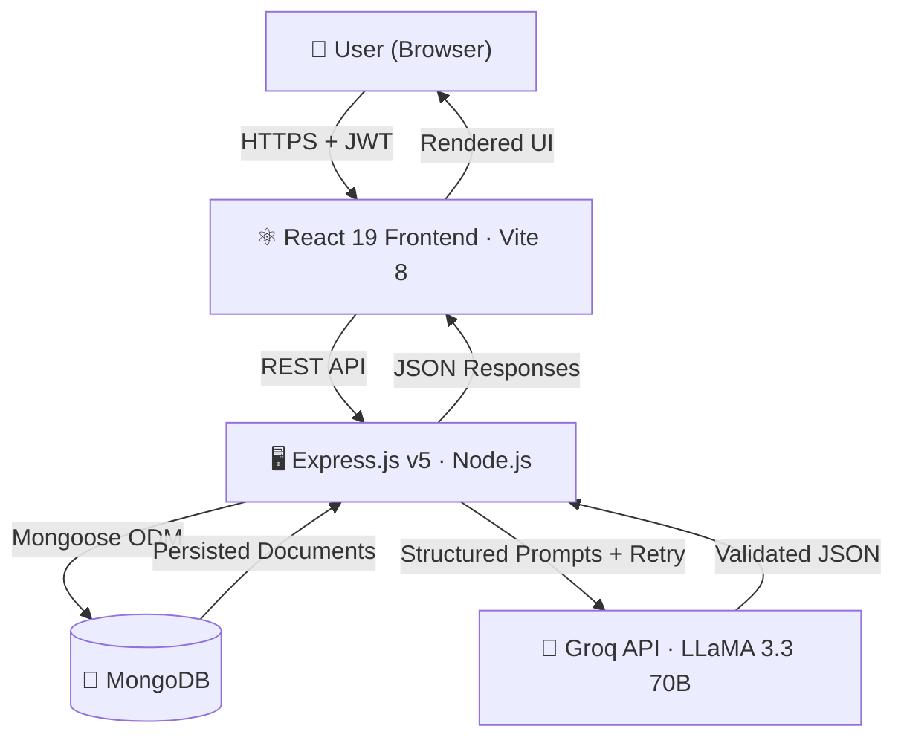
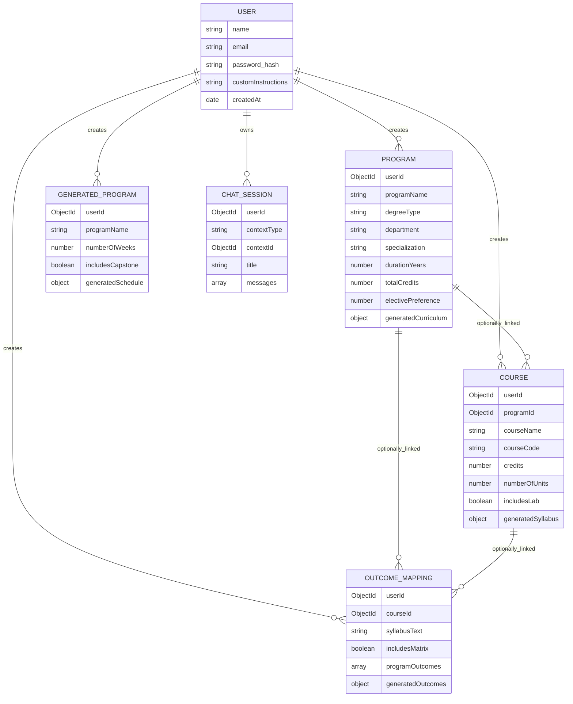

<div align="center">

#  CourseCraft-AI

### *The AI-Powered Academic Blueprint Engine*

> **Stop writing syllabi by hand.** Feed it a department and a dream — get back a complete, accreditation-ready academic program in seconds.

<br/>

[](https://nodejs.org/)
[](https://react.dev/)
[](https://www.mongodb.com/)
[](https://groq.com/)
[](https://vite.dev/)
[](https://tailwindcss.com/)

</div>

---

## 🌌 What Is CourseCraft-AI?

Designing a university course from scratch is a grind — professors spend days drafting syllabi, aligning outcomes to program objectives, and filling compliance matrices for bodies like **NBA** and **NAAC**. It's repetitive, slow, and painfully manual.

**CourseCraft-AI** obliterates that friction. It's a full-stack AI web app that takes a handful of inputs — degree type, department, specialization — and generates complete academic blueprints: semester-wise curricula, unit-wise syllabi, Bloom's Taxonomy-tagged Course Outcomes (COs), CO-PO correlation matrices, and week-wise learning program schedules.

```
Input: "B.Tech CSE — AI Specialization — 4 Years — 160 Credits"
Output: 8 fully-planned semesters, 40+ course syllabi, CO-PO matrices, and a chatbot tutor — in under 30 seconds.
```

**Built for:**
- 🏫 University professors designing or updating courses
- 🏛️ Academic administrators building new programs
- ✅ Institutions pursuing NBA / NAAC accreditation
- 🛠️ EdTech teams building curriculum tooling

---

## ✨ Feature Highlights

| ⚡ Feature | 📋 What It Does |
|---|---|
| **Curriculum Generator** | Full semester-by-semester plan from degree type, department, specialization, duration, credit count, and elective % (30/40/50%) |
| **Syllabus Builder** | Unit-wise breakdowns with topics, hours, objectives, prerequisites, and optional lab modules |
| **OBE Outcome Mapping** | Auto-generates 5–6 COs tagged to Bloom's Taxonomy levels from any syllabus text |
| **CO-PO Matrix** | AI-generated correlation matrix mapping COs to Program Outcomes on a 0–3 scale |
| **Weekly Program Scheduler** | Week-wise learning schedule for standalone programs/bootcamps with optional capstone |
| **Contextual AI Chatbot** | AI tutor scoped to your specific generated document — not generic AI, your AI |
| **Export to PDF** | Download curricula, syllabi, matrices, and schedules as formatted PDF reports |
| **Document Library** | Browse, view, and manage every document you've ever generated |
| **Multi-user Auth** | JWT-secured accounts — each user's content is fully isolated and persisted |

---

## 🏗️ System Architecture



### Architectural Layers

| Layer | Stack | Responsibility |
|---|---|---|
| **Presentation** | React 19, Vite 8, Tailwind CSS v4 | Components, custom hooks, `AuthContext` global session state |
| **API** | Express.js v5 | REST routes with domain-specific validation middleware |
| **Business** | Node.js Controllers + `groq.service.js` | Prompt engineering, JSON validation, retry logic, credit math |
| **Data** | Mongoose v9 + MongoDB | Schemas for Users, Programs, Courses, OutcomeMappings, GeneratedPrograms, ChatSessions |

---

## 🛠️ Tech Stack At-a-Glance

| Category | Tech | Version |
|---|---|---|
| **Frontend** | React + Vite | 19 / 8 |
| **Styling** | Tailwind CSS | v4 |
| **Routing** | React Router DOM | v7 |
| **HTTP Client** | Axios | v1 |
| **Icons** | Lucide React | latest |
| **Markdown** | react-markdown | v10 |
| **Backend** | Node.js + Express.js | v18+ / v5 |
| **Database** | MongoDB + Mongoose | v9 |
| **AI Engine** | Groq SDK + LLaMA 3.3 70B | latest |
| **Auth** | JWT + bcrypt | — |
| **Security** | Helmet + CORS | — |
| **PDF Export** | jsPDF + jspdf-autotable | v4 / v5 |
| **PDF Reading** | pdfjs-dist | v6 |
| **Dev Tools** | Nodemon + Concurrently | — |

---

## 🔄 How It Works (End-to-End Flow)

```
① User registers / logs in
        ↓  JWT issued → stored in localStorage → injected by Axios interceptors
② User submits curriculum inputs
        ↓  Degree, department, specialization, years, credits, elective %, career goals
③ Backend validates the request
        ↓  validate.middleware.js → credits 120–240, semesters = years × 2, elective % ∈ {30,40,50}
④ creditPlan.js pre-computes the credit plan
        ↓  JS handles all math — LLM never touches credits
⑤ Controller calls groq.service.js
        ↓  LLaMA 3.3 returns course names, codes, types, difficulty — not credits
⑥ Response is validated and merged
        ↓  JS-computed credits merged in; duplicate codes checked; PO count enforced (8–12)
⑦ Saved to MongoDB
        ↓  As Program / Course / OutcomeMapping / GeneratedProgram documents
⑧ Frontend renders the result
        ↓  With export options (PDF download)
⑨ User queries via Chatbot
        ↓  Bot fetches the saved document as context → scoped AI answers only
```

---

## 📁 Project Structure

```
coursecraft-ai/
│
├── 📦 package.json              ← Monorepo root (install:all, dev:all)
│
├── backend/
│   ├── server.js                ← Entry point — connect DB → start server
│   ├── .env.example             ← Environment variable template
│   └── src/
│       ├── app.js               ← Express setup (routes, middleware, CORS, Helmet)
│       ├── config/              ← db.js, env.js
│       ├── controllers/         ← auth, curriculum, course, outcome, program, chatbot
│       ├── middleware/          ← JWT auth, error handler, input validation
│       ├── models/              ← User, Program, Course, OutcomeMapping, GeneratedProgram, ChatSession
│       ├── routes/              ← Express route definitions per resource
│       ├── services/
│       │   └── groq.service.js  ← Core AI prompting, retry logic, JSON validation & merging
│       └── utils/               ← creditPlan.js, assignCredits.js
│
└── frontend/
    └── src/
        ├── App.jsx              ← Root routing tree with ProtectedRoute
        ├── main.jsx             ← React DOM entry point
        ├── components/          ← Domain-grouped components (auth, chatbot, course, curriculum…)
        ├── constants/           ← routes.js
        ├── context/             ← AuthContext.jsx — global session state
        ├── hooks/               ← useAuth, useChatbot, useCourses, useOutcomes, usePrograms, useGeneratedPrograms
        ├── pages/               ← Dashboard, Curriculum, Course, Outcome, Program, Library, Export, Chatbot, Profile, Landing, Login
        └── utils/               ← axiosInstance, pdfGenerator, pdfExtractor, bloomsUtils, timeAgo
```

---

## ⚙️ Getting Started

### Prerequisites

| Tool | Minimum Version |
|---|---|
| [Node.js](https://nodejs.org/) | v18+ |
| [MongoDB](https://www.mongodb.com/) | Local or Atlas |
| [Groq API Key](https://console.groq.com/) | Free tier available |
| Git | Any recent version |

### 1 — Clone

```bash
git clone https://github.com/AdithyaKuncham/CourseCraft-AI.git
cd CourseCraft-AI
```

### 2 — Install Dependencies

```bash
# Install everything at once (recommended)
npm run install:all

# Or install separately
cd backend && npm install
cd ../frontend && npm install
```

### 3 — Configure Environment

Create `backend/.env` (use `backend/.env.example` as a guide):

```env
PORT=5000
MONGODB_URI=mongodb+srv://<username>:<password>@cluster0.xxxxx.mongodb.net/?appName=Cluster0
JWT_SECRET=your_super_secret_jwt_key
FRONTEND_URL=http://localhost:5173
GROQ_API_KEY=your_groq_api_key_here
```

> **Frontend needs no `.env`** — the Vite dev server uses `http://localhost:5000` as configured in `axiosInstance.js`.

### 4 — Run

```bash
# Both frontend and backend (recommended)
npm run dev:all

# Or separately:
npm run dev:backend    # → http://localhost:5000
npm run dev:frontend   # → http://localhost:5173
```

Expected output:
```
[backend]  MongoDB connected
[backend]  Server running on port 5000
[frontend] ➜  Local:   http://localhost:5173/
```

---

## 📡 API Reference

### 🔐 Auth — `/api/auth`

| Method | Endpoint | Description |
|---|---|---|
| `POST` | `/register` | Register a new user |
| `POST` | `/login` | Login and receive JWT |
| `GET` | `/me` | Get current user profile |
| `PUT` | `/update-profile` | Update name or custom instructions |
| `PUT` | `/change-password` | Change password |
| `DELETE` | `/reset-profile` | Reset custom instructions |
| `DELETE` | `/delete-account` | Permanently delete account |

### 🗓️ Curriculum — `/api/curriculum`

| Method | Endpoint | Description |
|---|---|---|
| `POST` | `/generate` | Generate full semester curriculum |
| `GET` | `/my-programs` | List all saved programs |
| `GET` | `/stats` | Get generation stats |
| `GET` | `/:programId` | Retrieve a saved program |
| `DELETE` | `/:programId` | Delete a program |

### 📘 Courses — `/api/courses`

| Method | Endpoint | Description |
|---|---|---|
| `POST` | `/generate` | Generate detailed course syllabus |
| `GET` | `/my-courses` | List all saved courses |
| `GET` | `/:courseId` | Retrieve a saved course |
| `DELETE` | `/:courseId` | Delete a course |

### 🎯 Outcomes — `/api/outcomes`

| Method | Endpoint | Description |
|---|---|---|
| `POST` | `/generate-cos` | Generate COs from syllabus text |
| `POST` | `/generate-matrix` | Generate CO-PO correlation matrix |
| `POST` | `/save` | Save an outcome mapping |
| `GET` | `/my-mappings` | List all saved mappings |
| `GET` | `/:id` | Retrieve a mapping |
| `DELETE` | `/:id` | Delete a mapping |

### 📅 Programs — `/api/programs`

| Method | Endpoint | Description |
|---|---|---|
| `POST` | `/generate` | Generate a week-wise program schedule |
| `GET` | `/my-programs` | List all saved generated programs |
| `GET` | `/:programId` | Retrieve a generated program |
| `DELETE` | `/:programId` | Delete a generated program |

### 🤖 Chatbot — `/api/chatbot`

| Method | Endpoint | Description |
|---|---|---|
| `POST` | `/chat` | Send a message with document context |
| `GET` | `/sessions` | Retrieve all chat sessions |
| `GET` | `/sessions/:sessionId` | Retrieve a specific chat session |
| `DELETE` | `/sessions/:sessionId` | Delete a chat session |

<details>
<summary><strong>📦 Sample Request — Curriculum Generation</strong></summary>

```http
POST /api/curriculum/generate
Authorization: Bearer <token>
Content-Type: application/json

{
  "programName": "B.Tech Computer Science",
  "degreeType": "Bachelor of Technology",
  "department": "CSE",
  "specialization": "Artificial Intelligence",
  "durationYears": 4,
  "durationSemesters": 8,
  "totalCredits": 160,
  "electivePreference": 40,
  "careerGoals": "Machine Learning Engineer"
}
```

```json
// Abbreviated Response
{
  "_id": "64f3a...",
  "programName": "B.Tech Computer Science",
  "generatedCurriculum": {
    "programSummary": {
      "totalCoreCredits": 96,
      "totalElectiveCredits": 48,
      "totalOpenElectiveCredits": 16
    },
    "semesters": [
      {
        "semesterNumber": 1,
        "totalCredits": 20,
        "courses": [
          {
            "courseCode": "CSE101",
            "courseName": "Introduction to AI Fundamentals",
            "credits": 4,
            "type": "core",
            "hasLab": true,
            "difficultyLevel": "beginner"
          }
        ]
      }
    ],
    "programOutcomes": [
      { "poNumber": 1, "statement": "Apply knowledge of mathematics and AI..." }
    ]
  }
}
```
</details>

---

## 🗄️ Database Design



---

## 🧠 Engineering Deep-Dives

### ① Deterministic Credit Math — No LLM Gambling
LLMs produce inconsistent credit totals. `creditPlan.js` pre-computes the entire semester slot plan in pure JavaScript — distributing core, elective, and open-elective credits based on user preference (30/40/50%). The LLM only names courses. Credits are injected post-parse. A grand-total check guarantees exactness every time.

### ② Bulletproof JSON Extraction from LLM Responses
LLMs drift from schemas. `groq.service.js` uses heavily-constrained system prompts with explicit field definitions, example payloads, and a `callWithRetry` wrapper — up to 3 retries with exponential backoff on 429 rate-limit errors. Post-parse validation checks semester count, course count per semester (with auto-trim/pad), duplicate course codes, and PO count (8–12 enforced).

### ③ CO-PO Correlation Accuracy
Bloom's-aligned correlations need genuine educational reasoning — not keyword matching. The system prompt embeds full taxonomy definitions, a 0–3 rubric, and realistic sparsity guidance (50–60% of cells should be 0; max 20% at level 3) to get academically sound matrices.

### ④ RAG-Style Chatbot Without a Vector DB
No vector search pipeline needed. The chatbot fetches the user's exact saved MongoDB document and injects it as raw context into the LLM prompt. An `isOutOfContext` boolean on every message flags when the model correctly identifies a question outside its scope.

### ⑤ Groq Rate Limit Resilience
Large token payloads (full curriculum + POs) can trip rate limits. The `callWithRetry` wrapper detects `rate_limit` / `429` responses and retries with `2s → 4s → 8s` exponential backoff — transparent to the user.

---

## 🔮 Roadmap

- [ ] 🤝 **Collaborative Editing** — Multiple faculty co-designing a curriculum in real time
- [ ] 📄 **NBA/NAAC Report Export** — Auto-generate compliance reports in accreditation formats
- [ ] 📊 **Analytics Dashboard** — CO attainment tracking and PO heatmaps across a department
- [ ] 🕰️ **Version History** — Track syllabus changes over academic years
- [ ] 🗂️ **Template Library** — Community-shared templates for common degree programs
- [ ] 🌐 **Multilingual Support** — Syllabi generation for regional language institutions
- [ ] 🔗 **LMS Integration** — Push courses directly to Moodle or Google Classroom

---
<div align="center">

## 👤 Author
*Kuncham Adithya*

[](https://www.linkedin.com/in/adithya-kuncham/)
[](https://github.com/AdithyaKuncham)

<br/>

⚡ *Turning weeks of curriculum committee meetings into a single API call.*

</div>
